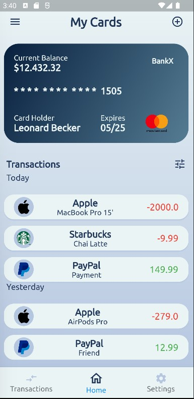

# banking_home

Banking overview screen interface. Build while learning flutter. 

Every shown data is fiction and for demo purpose only. 

## Inspiration

[Link](https://dribbble.com/shots/6351511-Menu-and-Dashboard/attachments/6351511-Menu-and-Dashboard?mode=media)

## UI

## Getting Started

This project is a starting point for a Flutter application.

A few resources to get you started if this is your first Flutter project:

- [Lab: Write your first Flutter app](https://docs.flutter.dev/get-started/codelab)
- [Cookbook: Useful Flutter samples](https://docs.flutter.dev/cookbook)

For help getting started with Flutter development, view the
[online documentation](https://docs.flutter.dev/), which offers tutorials,
samples, guidance on mobile development, and a full API reference.

## Resources 

<a href="https://www.flaticon.com/de/kostenlose-icons/paypal" title="paypal Icons">Paypal Freepik - Flaticon</a>
<a href="https://www.flaticon.com/de/kostenlose-icons/mac" title="mac Icons">Mac Freepik - Flaticon</a>
<a href="https://www.flaticon.com/de/kostenlose-icons/starbucks" title="starbucks Icons">Starbucks Freepik - Flaticon</a>